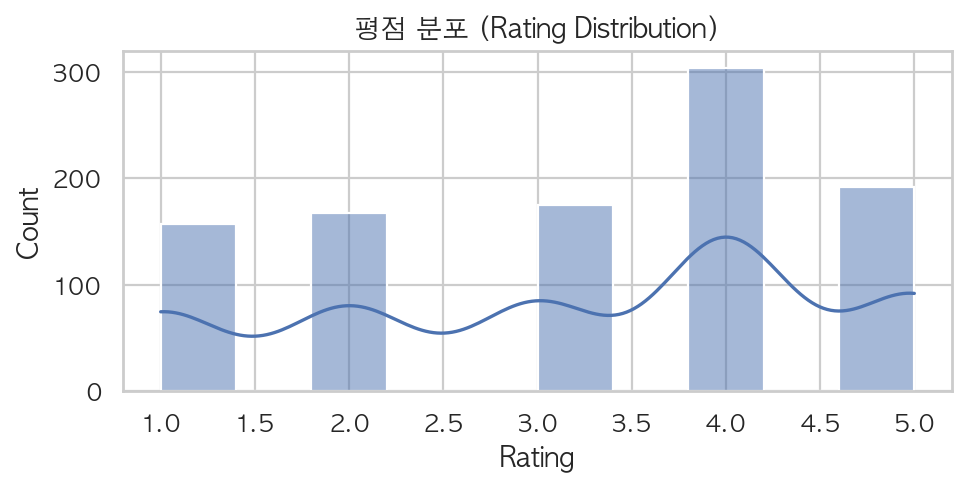
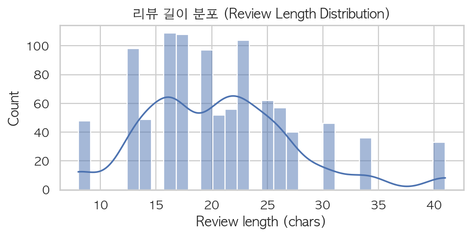
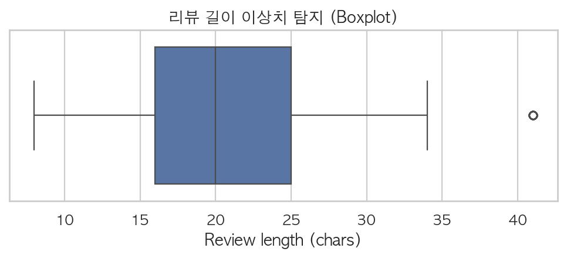
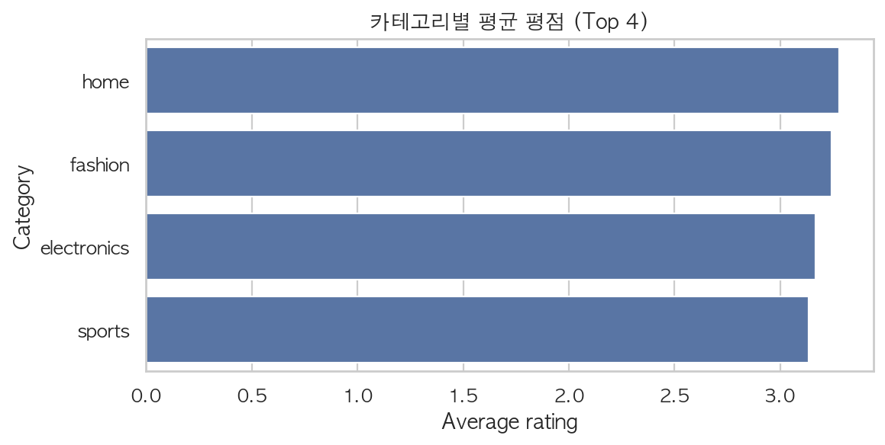
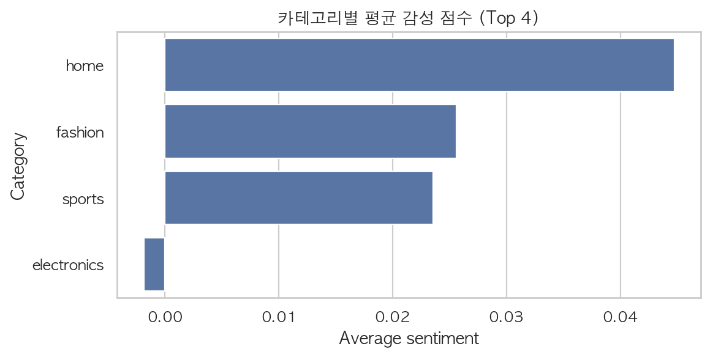
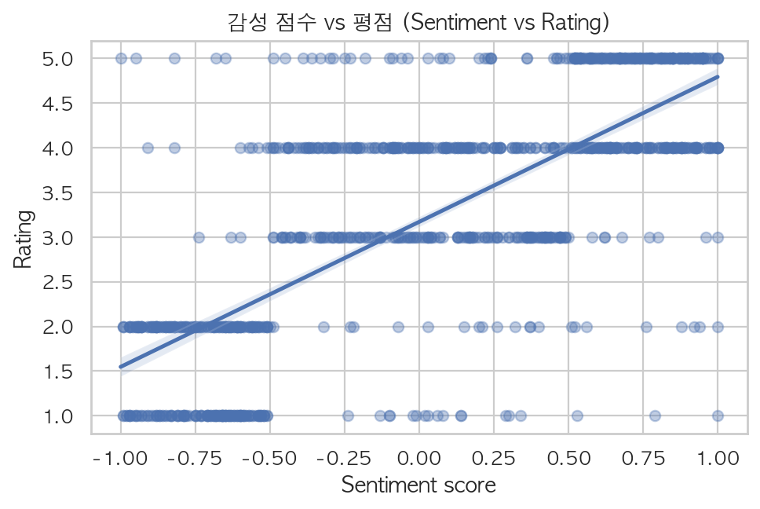
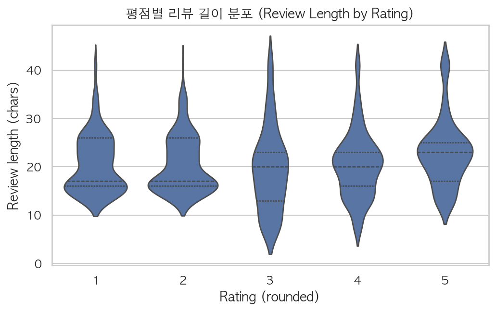

# EDA Report: Reviews Dataset

**작성자:** Cloud 1기 백강민

**입력 파일:** `reviews_1000.csv`


---

## 목차

1. 데이터 개요 및 컬럼 매핑

2. 전처리 요약 (결측/이상치)

3. 기술 통계 요약

4. 시각화 결과

5. AI 분석 관점 인사이트 (Q1~Q3) + 3줄 요약

6. 재현 방법 (Reproducibility)


---

## 1. 데이터 개요 및 컬럼 매핑

- 본 리포트는 `reviews_1000.csv` 리뷰 데이터를 기반으로 EDA를 수행합니다.

### 컬럼 매핑 (자동 추론 결과)

- text: `review_text`

- rating: `rating`

- category: `category`

- sentiment_score: `sentiment_score`


## 2. 전처리 요약 (결측/이상치)

- rows_before → rows_after: **1000 → 995**

- rows_dropped(필수값 결측/빈텍스트/빈카테고리 제거): **5**

- NA cells before → after: 5 → 0

- review_length IQR 이상치: **33** (lower=2.5, upper=38.5)


## 3. 기술 통계 요약

- 평점 범위: 1.0 ~ 5.0

- 평점 평균±표준편차: 3.208 ± 1.355

- 리뷰 길이 평균±표준편차: 20.8 ± 7.0 (chars)


### 3.1 Overall describe

| metric          |   count |    mean |    std |   min |   25% |   50% |    75% |   max |
|:----------------|--------:|--------:|-------:|------:|------:|------:|-------:|------:|
| rating          |     995 |  3.208  | 1.3546 |     1 |  2    |  3    |  4     |     5 |
| review_length   |     995 | 20.7528 | 6.9933 |     8 | 16    | 20    | 25     |    41 |
| sentiment_score |     995 |  0.0232 | 0.6151 |    -1 | -0.59 |  0.03 |  0.595 |     1 |


### 3.2 Category aggregates (Top 20)

| category    |   count |   avg_rating |   std_rating |   avg_length |   std_length |   avg_sentiment |
|:------------|--------:|-------------:|-------------:|-------------:|-------------:|----------------:|
| home        |     256 |       3.2773 |       1.4021 |      20.6211 |       6.8537 |          0.0447 |
| fashion     |     258 |       3.2442 |       1.2656 |      21.0233 |       7.1018 |          0.0256 |
| electronics |     249 |       3.1687 |       1.3662 |      20.8153 |       7.2193 |         -0.0018 |
| sports      |     232 |       3.1336 |       1.3877 |      20.5302 |       6.8097 |          0.0235 |


## 4. 시각화 결과

### 4.1 평점 분포



- 해석: 특정 평점 구간에 몰림이 크면(예: 4~5점 집중) 만족도 편향 가능성이 있습니다.


### 4.2 리뷰 길이 분포 & 이상치






- 해석: 긴 꼬리/극단값이 많으면 전처리(자르기/요약) 정책이 모델 입력에 영향을 줄 수 있습니다.


### 4.3 카테고리별 평균 평점



- 해석: 카테고리별 평균 평점의 차이가 크면, 카테고리 자체가 만족도에 영향을 줄 수 있습니다.


### 4.4 카테고리별 평균 감성 점수



- 해석: 감성 점수가 특정 카테고리에 치우치면 도메인 편향 가능성을 의심할 수 있습니다.


### 4.5 감성 점수 vs 평점



- 해석: 회귀선과 점들의 분산을 함께 보며 선형 관계의 강도를 확인합니다.


### 4.6 평점별 리뷰 길이 분포 (Violin)



- 해석: 평점에 따라 리뷰 길이가 체계적으로 달라진다면, 길이로 인한 입력 편향 가능성이 있습니다.


## 5. AI 분석 관점 인사이트 (Q1~Q3) + 3줄 요약

### Q1) sentiment_score가 높을수록 평점이 높나?

- 지표: sentiment_score↔rating Pearson = `0.737029`

- 결론: sentiment_score와 평점은 양(+)의 관계 경향이 있습니다.
- 지표: Pearson r=0.737 (강함).
- 그래프 해석: 회귀선 주변으로 점들이 모이면 관계가 더 뚜렷합니다.


### Q2) review_length가 AI 임베딩 유사도에 영향을 줄 수 있나?

- 지표: review_length↔rating Pearson = `0.090712`

- 지표: review_length↔sentiment Pearson = `0.107127`

- 결론: 리뷰 길이(review_length) 자체가 평점/감성과 강하게 연결되진 않을 가능성이 큽니다.
- 지표(길이↔평점): r=0.091 (거의 없음)
- 지표(길이↔감성): r=0.107 (약함)
- AI/임베딩 관점: 길이 차이로 인해 truncation(잘림), 요약/전처리 정책 차이가 생기면 내용이 비슷해도 임베딩이 달라지거나, 반대로 다른 문장도 비슷하게 뭉개질 수 있습니다.


### Q3) category 별 감성 점수 평균 차이는 존재?

- 지표: category sentiment gap(max-min) = `0.046574`

- 결론: 카테고리별 평균 감성 점수 차이는 크지 않을 수 있습니다(데이터에 따라 다름).
- 지표: 최고(home=0.045) - 최저(electronics=-0.002) = 0.047
- 그래프 해석: 상위/하위 카테고리 간 막대 길이가 벌어질수록 차이가 큽니다.


### 3줄 요약

1) 감성↔평점: r=0.737 (강함) → 감성 점수가 높을수록 평점도 대체로 높음.
2) 길이↔평점: r=0.091 (거의 없음) → 길이만으로 평점이 결정되진 않음.
3) 카테고리별 감성 차이: 최고-최저=0.047 → 카테고리별 감성이 크게 갈리진 않음(또는 제한적).


## 6. 재현 방법 (Reproducibility)

아래 명령으로 동일한 산출물(리포트/그림/전처리 CSV)을 재현할 수 있습니다.


```bash

python eda_report.py --input "reviews_1000.csv" --outdir "eda_report" --encoding utf-8 --topn_categories 30

```


### 분석 파이프라인 요약

- 전처리: 결측 제거(필수값), 타입 변환, review_length 생성, IQR 기반 길이 이상치 플래그

- 시각화: 평점 분포, 길이 분포, 길이 boxplot, 카테고리 평균 평점, (옵션) 카테고리 감성, (옵션) 감성↔평점, 평점별 길이 violin

- 인사이트: 상관계수/카테고리 격차 + 그래프 기반 해석 + 3줄 요약
